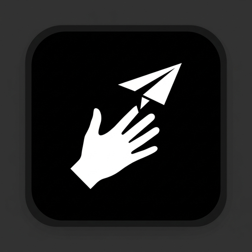

<div align="center">
  
  <h1>🪄 Fadlan Send</h1>

  [](https://python.org)
  [](https://flask.palletsprojects.com/)
  [](https://mediapipe.dev/)
  [](https://web.dev/progressive-web-apps/)
  <br>
  [](https://opensource.org/licenses/MIT)
  [](https://github.com/MAliffadlan/magic_file_transfer)
  [](https://github.com/MAliffadlan/magic_file_transfer/stargazers)
</div>

<div align="center">
  <h3>🌐 Language / Bahasa</h3>
  <a href="#-bahasa-indonesia">🇮🇩 Bahasa Indonesia</a> · <a href="#-english">🇬🇧 English</a>
</div>

---

<div align="center">
  <h3>🎬 Demo</h3>
  
  
</div>

<div align="center">

<p>Alternatif: https://drive.google.com/file/d/19h_wNgkmquCCieGkJ1SjriyyexvwX4JB/view?usp=sharing</p>
</div>

---

# 🇮🇩 Bahasa Indonesia

<p align="center"><b>Transfer file dari HP Android ke Laptop dalam sekejap mata — cukup dengan gerakan tangan.</b></p>

<div align="center">
  <blockquote>✊ Genggam → 🖐️ Buka → 💥 File mendarat di laptop!</blockquote>
</div>

## ⚡ Kenapa Fadlan Send?

Bosan colok kabel USB? Males buka WhatsApp Web cuma buat kirim satu foto? **Fadlan Send** hadir sebagai solusi transfer file yang *benar-benar* ajaib:

> Pilih foto di Galeri → Share ke Fadlan Send → Kepal tangan ✊ → Buka jari 🖐️ → **BAM!** File langsung muncul di layar laptop.

Tidak ada kabel. Tidak ada login. Tidak ada aplikasi berat. Cukup **tangan kosong**.

---

## 🌟 Fitur

### 🤖 Smart AI Gesture Engine v2
- Deteksi **4 jari sekaligus** (telunjuk, tengah, manis, kelingking) untuk kepalan yang presisi
- **Anti False Trigger** — harus terdeteksi 8 frame berturut-turut
- **Hold Duration** — tangan harus digenggam minimal 1 detik sebelum bisa dilempar
- **Cooldown 3 detik** — mencegah pengiriman ganda yang tidak disengaja
- **Open Validation** — buka tangan harus stabil 5 frame sebelum dianggap sah

### 📲 Native Android Share Integration (PWA)
- Terinstall seperti aplikasi biasa di Home Screen HP
- Muncul langsung di menu **"Bagikan"** bawaan Android (sebelahan sama WhatsApp, Telegram, dll)
- File langsung tertangkap server tanpa perlu pilih ulang

### 🎶 Immersive UX Feedback
- **Sound Effects** — suara synth yang disintesis langsung di browser via Web Audio API (tanpa file audio!)
  - *Wush* saat mulai menggenggam
  - *Tiim* saat genggaman terkunci (armed) 
  - *Ziuung* saat melempar
  - *Ting-ting* saat berhasil mendarat
- **Haptic Vibration** — HP bergetar sesuai tahapan gesture
- **Flying Animation** — ikon 📄 terbang meluncur keluar layar saat file dilempar

### 💻 Auto-Open di Desktop
File yang mendarat di laptop **langsung terbuka otomatis** dengan aplikasi default:

| Jenis File | Dibuka Dengan |
|:---:|:---:|
| 📸 Foto | Image Viewer |
| 🎬 Video | Video Player |
| 📄 PDF | Document Reader |
| 🎵 Audio | Music Player |
| 📝 Teks | Text Editor |

### 🔔 Desktop Notification
Notifikasi OS muncul instan di sudut layar laptop setiap kali file berhasil diterima.

### 🕵️ Hidden Camera Mode
Kamera aktif di latar belakang tapi **tidak terlihat di UI** sama sekali. Tampilannya bersih, hanya kotak instruksi bergaris putus-putus yang elegan.

### 🔒 Privacy First
> **Privasi terjaga:** Pelacakan tangan diproses **100% lokal di perangkatmu** menggunakan MediaPipe. Tidak ada data kamera yang dikirim ke server. Kameramu, datamu.

---

## 🛠️ Kebutuhan Sistem

**Laptop / Desktop (Penerima)**
- Python 3.8+
- Satu jaringan Wi-Fi dengan HP

| OS | Status | Perintah Buka File |
|:---:|:---:|:---:|
| 🐧 Linux (Mint/Ubuntu/Debian) | ✅ Fully Supported | `xdg-open` + `notify-send` |
| 🍎 macOS | 🚧 Coming Soon | `open` |
| 🪟 Windows | 🚧 Coming Soon | `start` |

**Smartphone Android (Pengirim)**
- Google Chrome 76+
- Kamera depan yang berfungsi

---

## 🚀 Instalasi

### 1. Clone & Install

```bash
git clone https://github.com/MAliffadlan/magic_file_transfer.git
cd magic_file_transfer
pip install -r requirements.txt
```

### 2. Jalankan Server

```bash
python3 receiver.py
```

### 3. Buat Tunnel HTTPS (Wajib untuk PWA)

PWA di Android **membutuhkan HTTPS**. Gunakan [Cloudflare Tunnel](https://developers.cloudflare.com/cloudflare-one/connections/connect-networks/downloads/):

```bash
cloudflared tunnel --url http://127.0.0.1:5050
```

Catat URL `https://xxxx.trycloudflare.com` yang muncul.

### 4. Install di HP Android

1. Buka link Cloudflare di Chrome HP
2. Tap tombol **📲 Install Aplikasi**
3. **Fadlan Send** kini ada di Home Screen!

---

## 🪄 Cara Pakai

```
1. Buka Galeri → Pilih foto/video
2. Tap "Bagikan" → Pilih "Fadlan Send"
3. Layar hijau berkedip = file sudah siap
4. Kepalkan tangan ✊ di depan kamera → Tahan 1 detik
5. Status berubah "SIAP DILEMPAR!" 🔥
6. Buka jari lebar 🖐️ → File terbang ke laptop!
7. File langsung terbuka otomatis di layar laptop 🎉
```

---

## 📁 Struktur Proyek

```
fadlan-send/
├── receiver.py          # Server Flask (penerima file)
├── templates/
│   └── index.html       # Web UI + MediaPipe + Gesture Engine
├── manifest.json        # PWA manifest (Share Target)
├── sw.js                # Service Worker
├── icon-192.png         # App icon 192x192
├── icon-512.png         # App icon 512x512
├── requirements.txt     # Python dependencies
└── .gitignore
```

---

## ⚠️ Catatan Penting

- URL Cloudflare Tunnel bersifat **sementara** — berubah setiap restart. Setelah restart tunnel, **hapus & install ulang** aplikasi di HP.
- Untuk URL permanen, gunakan [Cloudflare Named Tunnel](https://developers.cloudflare.com/cloudflare-one/connections/connect-networks/get-started/).
- Jika tampilan tidak berubah setelah update, clear cache browser atau reinstall PWA.

---

<div align="center">
  <a href="#-language--bahasa">⬆️ Kembali ke atas</a>
</div>

---

# 🇬🇧 English

<p align="center"><b>Transfer files from your Android phone to your Laptop in the blink of an eye — using nothing but hand gestures.</b></p>

<div align="center">
  <blockquote>✊ Clench → 🖐️ Open → 💥 File lands on your laptop!</blockquote>
</div>

## ⚡ Why Fadlan Send?

Tired of plugging in USB cables? Don't want to open WhatsApp Web just to send a single photo? **Fadlan Send** is a file transfer solution that's *truly* magical:

> Pick a photo in Gallery → Share to Fadlan Send → Clench your fist ✊ → Open your fingers 🖐️ → **BAM!** File instantly appears on your laptop screen.

No cables. No login. No heavy apps. Just your **bare hands**.

---

## 🌟 Features

### 🤖 Smart AI Gesture Engine v2
- Detects **4 fingers simultaneously** (index, middle, ring, pinky) for precise fist recognition
- **Anti False Trigger** — must be detected for 8 consecutive frames
- **Hold Duration** — fist must be held for at least 1 second before throwing
- **3-second Cooldown** — prevents accidental duplicate sends
- **Open Validation** — open hand must be stable for 5 frames to be considered valid

### 📲 Native Android Share Integration (PWA)
- Installs like a regular app on your phone's Home Screen
- Appears directly in Android's native **"Share"** menu (right alongside WhatsApp, Telegram, etc.)
- File is captured by the server instantly — no need to re-select

### 🎶 Immersive UX Feedback
- **Sound Effects** — synthesized sounds generated directly in the browser via Web Audio API (no audio files needed!)
  - *Whoosh* when you start clenching
  - *Teem* when the fist locks in (armed)
  - *Zwoom* when throwing
  - *Ting-ting* upon successful landing
- **Haptic Vibration** — phone vibrates in sync with each gesture stage
- **Flying Animation** — a 📄 icon flies across the screen when the file is thrown

### 💻 Auto-Open on Desktop
Files that land on your laptop **open automatically** with the default application:

| File Type | Opens With |
|:---:|:---:|
| 📸 Photo | Image Viewer |
| 🎬 Video | Video Player |
| 📄 PDF | Document Reader |
| 🎵 Audio | Music Player |
| 📝 Text | Text Editor |

### 🔔 Desktop Notification
An OS notification appears instantly in the corner of your laptop screen every time a file is successfully received.

### 🕵️ Hidden Camera Mode
The camera is active in the background but **completely invisible in the UI**. The interface stays clean — just an elegant dashed-border instruction box.

### 🔒 Privacy First
> **Privacy focused:** Hand tracking is processed **entirely on your device** using MediaPipe. No camera data is ever sent to the server. Your camera, your data.

---

## 🛠️ System Requirements

**Laptop / Desktop (Receiver)**
- Python 3.8+
- Same Wi-Fi network as your phone

| OS | Status | File Open Command |
|:---:|:---:|:---:|
| 🐧 Linux (Mint/Ubuntu/Debian) | ✅ Fully Supported | `xdg-open` + `notify-send` |
| 🍎 macOS | 🚧 Coming Soon | `open` |
| 🪟 Windows | 🚧 Coming Soon | `start` |

**Android Smartphone (Sender)**
- Google Chrome 76+
- Working front camera

---

## 🚀 Installation

### 1. Clone & Install

```bash
git clone https://github.com/MAliffadlan/magic_file_transfer.git
cd magic_file_transfer
pip install -r requirements.txt
```

### 2. Start the Server

```bash
python3 receiver.py
```

### 3. Create an HTTPS Tunnel (Required for PWA)

PWA on Android **requires HTTPS**. Use [Cloudflare Tunnel](https://developers.cloudflare.com/cloudflare-one/connections/connect-networks/downloads/):

```bash
cloudflared tunnel --url http://127.0.0.1:5050
```

Note the `https://xxxx.trycloudflare.com` URL that appears.

### 4. Install on Android Phone

1. Open the Cloudflare link in Chrome on your phone
2. Tap the **📲 Install App** button
3. **Fadlan Send** is now on your Home Screen!

---

## 🪄 How to Use

```
1. Open Gallery → Select a photo/video
2. Tap "Share" → Choose "Fadlan Send"
3. Green screen flash = file is ready
4. Clench your fist ✊ in front of the camera → Hold for 1 second
5. Status changes to "READY TO THROW!" 🔥
6. Open your fingers wide 🖐️ → File flies to your laptop!
7. File opens automatically on your laptop screen 🎉
```

---

## 📁 Project Structure

```
fadlan-send/
├── receiver.py          # Flask server (file receiver)
├── templates/
│   └── index.html       # Web UI + MediaPipe + Gesture Engine
├── manifest.json        # PWA manifest (Share Target)
├── sw.js                # Service Worker
├── icon-192.png         # App icon 192x192
├── icon-512.png         # App icon 512x512
├── requirements.txt     # Python dependencies
└── .gitignore
```

---

## ⚠️ Important Notes

- Cloudflare Tunnel URLs are **temporary** — they change on every restart. After restarting the tunnel, **uninstall & reinstall** the app on your phone.
- For a permanent URL, use [Cloudflare Named Tunnel](https://developers.cloudflare.com/cloudflare-one/connections/connect-networks/get-started/).
- If the UI doesn't update after changes, clear your browser cache or reinstall the PWA.

---

<div align="center">
  <a href="#-language--bahasa">⬆️ Back to top</a>
</div>

---

<div align="center">
  <sub>Made with ☕ and sleepless nights by <a href="https://github.com/MAliffadlan"><b>@MAliffadlan</b></a></sub>
</div>
